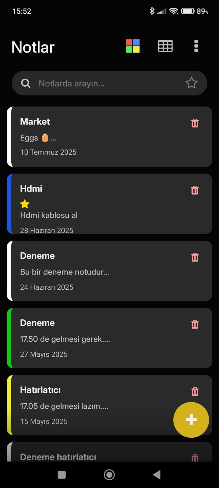
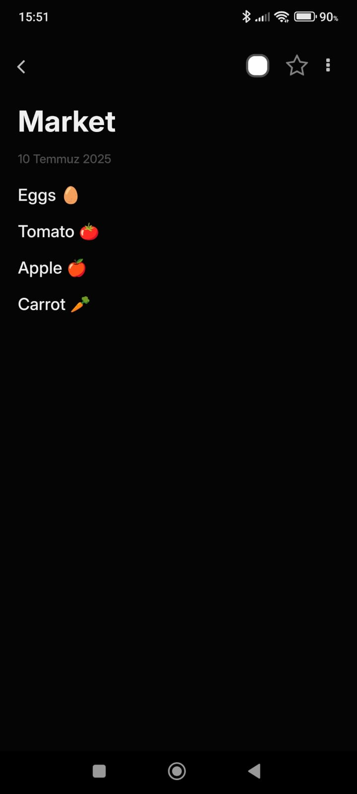
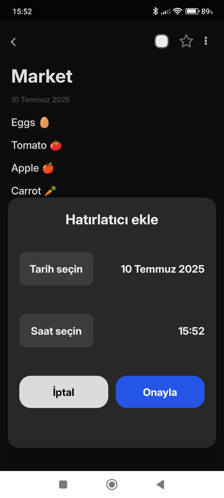

# 📝 NoteApp - React Native + Expo

A simple and intuitive note-taking app built with React Native and Expo. Users can create, edit, and delete notes easily with a clean and responsive interface.

## ✨ Features

- 📌 Add, edit, and delete notes
- 🔍 Search through your notes
- 🧠 Minimal and distraction-free design
- 💾 Data persistence using AsyncStorage

## 📱 Screenshots

### Home Screen

### Add Note Screen

### Reminder Screen

